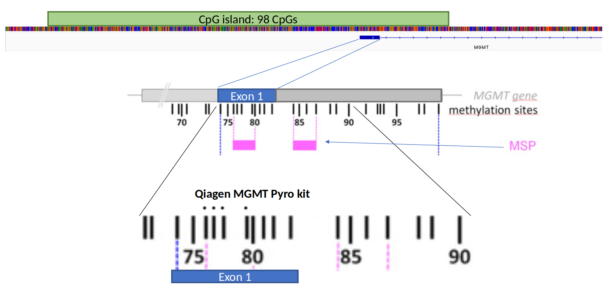

```{r setup, include=FALSE}
knitr::opts_chunk$set(dpi = 100,
                      echo=TRUE,
                      warning=FALSE, message=FALSE, eval = TRUE,
                      fig.show=TRUE, fig.width= 5,fig.height= 5,fig.align='center',
                      out.width = '50%', fig.path= 'AutoFigures/')
```

## Figures

### MGMT Promoter CpG island and methods of evaluation
```{r Promoter, echo=FALSE, out.width="100%", fig.cap="Organization of the MGMT promoter. MSP refers to the typical primer sites of methylation specific PCR to determine MGMT promoter methylation. Asterixes represent the 4 CpGs analysed by the Qiagen MGMT pyrosequencing kit."}


```


```{r MGMT_stats, echo=FALSE}

library(ggplot2)
library(dplyr)
library(tidyr)
library(janitor)
library(kableExtra)
library(RColorBrewer)
library(scales)

load("MGMT_R/R-markdown/Data/MGMT_R.Rdata")
#MGMT_RunSum <- read.csv("MGMT_R/R-markdown/Data/newRunsum.csv", row.names = 1)

# Summarize and count tumors
Table <- MGMT_RunSum %>%
  dplyr::select(SampleID,Series,Diagnosis) %>%
  distinct() %>%
  dplyr::group_by(Series,Diagnosis) %>%
  tally() %>%
  spread(Diagnosis,n) %>%
  replace(is.na(.), 0) %>%
  adorn_totals(c("row", "col"))

#transpose and name columns
Table <- row_to_names(t(Table),1)

```

Table has been reformated for Latex
```{r Sample_overview, echo=FALSE}

knitr::kable(Table,align = "lccccccc", format="pipe", booktabs=TRUE, caption = "Overview of samples included in this study")

#knitr::kable(Table,align = "lccccccc", format="html", booktabs=TRUE, caption = "Overview of samples included in this study")

#knitr::kable(Table,align = "lcccc", format="latex", caption = "Overview of samples included in this study") %>% kable_styling(latex_options="scale_down")

```

### Overview of samples included in study
```{r, Methylation_overview, echo=FALSE,  out.width="100%", fig.cap="Distribution of methylated versus unmethylated samples according to known status prior to nanopore sequencing"}
ggplot(MGMT_RunSum, aes(y=Diagnosis, fill=Known_status))+
  geom_bar(stat = "count")+
  scale_fill_brewer(name="Mehtylation Status", palette="Set1")+
  theme_bw()+
  theme(legend.position = "top")

```

Also simplified version

```{r Methylation_overview_simplified, echo=FALSE, out.width="100%", fig.cap="Distribution of methylated versus unmethylated samples according to known status prior to nanopore sequencing"}
barplot_data <- MGMT_RunSum %>% dplyr::select(c(SampleID, Diagnosis, Known_status)) %>%
  distinct() %>%
  group_by(Diagnosis, Known_status) %>%
  tally() %>%
  spread(Diagnosis,n) %>%
  replace(is.na(.), 0) %>%
  dplyr::mutate(Other = rowSums(dplyr::select(.,c(LGG_PA,ATRT_SHH, Ganglioglioma, HPC, Medulloblastoma, PCNSL, PXA, Metastasis, Unknown)))) %>%
  dplyr::mutate('IDH-glioma' = rowSums(dplyr::select(.,c(Astrocytoma,`Astrocytoma HG`, Oligodendroglioma)))) %>%
  dplyr::select(c(Known_status,'IDH-glioma',Meningioma, Glioblastoma, Other)) %>%
  gather(key=Diagnosis, value = Samples, -Known_status)


barplot_data$Diagnosis <- factor(barplot_data$Diagnosis, levels = c("Other","Meningioma", 'IDH-glioma',"Glioblastoma" ))

ggplot(barplot_data, aes(y=Diagnosis, x= Samples, fill=Known_status, label = Samples))+
  geom_bar(stat = "identity")+
  scale_fill_brewer(name="Known Status", palette="Set1")+
  geom_text(size = 3, position = position_stack(vjust = 0.5))+
  theme_bw(base_size = 10)+
  ylab("")+
  theme(legend.position = "top", aspect.ratio = 0.3 )
```


## Data acquisition

```{r Coverage_Method, echo=FALSE, fig.cap="Sequencing depth of samples by method of acquisition, group median represented by red diamond. No bias in sequence depth observed between methylated and unmethylated samples."}
# Distribution of hits in RIO by Methylation status and sequencing method
ggplot(MGMT_RunSum, aes(x=Method, y=Depth))+
  geom_boxplot(aes(fill=Known_status), alpha = 0.2)+
  geom_point(size = 3, position = position_jitterdodge(0.2,0), alpha = 0.7, aes(color=Known_status))+
  scale_color_brewer(name="Known Status", palette = "Set1")+
  scale_fill_brewer(name="Known Status", palette="Set1")+
  scale_x_discrete(labels = c("Adaptive\nSampling", "Barcoded", "Single"))+
  scale_y_continuous(trans = 'log10', breaks = c(1,10,100,1000), limits = c(0.9,1000))+
  xlab ("")+
  ylab("Sequence depth") +
  theme_bw(base_size = 16)
```

```{r Coverage_Dataset, echo=FALSE, eval=FALSE, fig.cap="Sequencing depth of methods, group median represented by red diamond. Single sample runs generally have higher sequence depth than barcoded samples or adaptive sampling."}
ggplot(MGMT_RunSum, aes(x=Series, y=Depth))+
  geom_boxplot(aes(color=Method), alpha=0.1) +
  geom_point(size = 2, position = position_jitterdodge(0.2,0), alpha = 0.6, aes(color=Method)) +
  #stat_summary(fun=median, geom="point", shape="-", size=12, color="black",alpha = 0.8,position = position_dodge(0.8), aes(fill=Method))+
  scale_color_viridis_d(name="Method")+
  scale_fill_discrete(guide="none")+
  labs(fill = "", color = "Method")+
  scale_color_viridis_d()+
  scale_y_log10()+
  xlab ("")+
  ylab("Sequence depth") +
  theme_bw(base_size = 14) + theme(axis.text.x = element_text(angle = 45, hjust=1))
```

## Direct comparison of Nanopore sequencing and Pyrosequencing

Comparison of individual CpGs as measured by nanopore and pyrosequencing

```{r Compare_Individual, echo=FALSE, out.width="100%", fig.cap="Comparison of individual CpGs within exon 1" }
library(ggpubr)

#FOUR_CpGs <- read.csv("MGMT_R/R-markdown/Data/newFOUR_CPGs.csv", row.names = 1)

FOUR_CpGs$Pos <- gsub("CpG1", "CpG 76",FOUR_CpGs$Pos)
FOUR_CpGs$Pos <- gsub("CpG2","CpG 77",FOUR_CpGs$Pos)
FOUR_CpGs$Pos <- gsub("CpG3","CpG 78",FOUR_CpGs$Pos)
FOUR_CpGs$Pos <- gsub("CpG4","CpG 79",FOUR_CpGs$Pos)


ggplot(FOUR_CpGs, aes(x=Percent_Meth_Pyro, y=Percent_Meth_Nano, color = Pos))+
  geom_smooth(method = lm, color="black")+
  stat_regline_equation(label.y = 10, label.x = 60,aes(label = ..rr.label..),color = "black")+
  geom_point(aes(size=Depth), alpha = 0.6)+
  scale_size_continuous(name="Depth",breaks = c(5,15,25,100,150), range = c(1,8))+
  xlab("Pyro sequencing")+
  ylab("Nanopore sequencing")+
  theme_bw()+
  scale_color_brewer(palette = "Set2", guide="none")+
  facet_wrap(.~Pos)

```

Group average as measured by nanopore and pyrosequencing
```{r Compare_Group, echo=FALSE, out.width="100%", fig.width=10, fig.height=5, fig.cap="Comparison of nanopore sequencing and Pyrosequencing results of 4 CpGs in exon 1 of the MGMT promoter. Plotted values are average methylation of 4 CpGs. Black horizontal and vertical lines mark the 9 percent cut-off value between methylated and unmethylated samples, as determined by pyrosequencing."}
library(ggpubr)
#Compare_CpGs_GROUP <- read.csv("MGMT_R/R-markdown/Data/Compare_CpGs_Group.csv", row.names = 1)

Compare_CpGs_Radium <- Compare_CpGs_GROUP %>% filter(DataSet == "Radium")

ggplot(Compare_CpGs_Radium, aes(x=Pyro_4_CpG_average, y=Nano_4_CpG_average)) +
  geom_smooth(method = "lm", color="black") +
  geom_point(aes(size=Coverage), alpha = 0.8, color="CornflowerBlue")+
  stat_regline_equation(label.y = 20, label.x = 60,aes(label = ..rr.label..),color = "black", size=4)+
  #scale_color_brewer(palette = "Set1", guide="none")+
  scale_size_continuous(name="Depth",breaks = c(5,10,50,100,150), range = c(1,10) )+
  xlab("Pyro sequencing")+
  ylab("Nanopore sequencing")+
  geom_hline(yintercept = 10)+
  geom_vline(xintercept = 10)+
  theme(aspect.ratio = 1)+
  theme_bw()

# GROUP <- FOUR_CpGs %>%
#           select(1:3,6:9) %>%
#           group_by(Series, SampleID,Depth) %>%
#           summarise(Average_Meth_Nano = mean(Percent_Meth_Nano),Average_Meth_Pyro = mean(Percent_Meth_Pyro))
#
# ggplot(GROUP, aes(x=Average_Meth_Pyro, y=Average_Meth_Nano)) +
#   geom_smooth(method = "lm", color="black") +
#   geom_point(aes(size=Depth), alpha = 0.6, color="cornflowerblue")+
#   stat_regline_equation(label.y = 80, label.x = 20,aes(label = ..rr.label..),color = "black", size=4)+
#   #scale_color_brewer(palette = "Set1", guide="none")+
#   scale_size_continuous(name="Depth",breaks = c(5,10,50,100,150), range = c(1,16) )+
#   xlab("Pyro sequencing")+
#   ylab("Nanopore sequencing")+
#   geom_hline(yintercept = 9)+
#   geom_vline(xintercept = 9)+
#   # scale_y_sqrt(breaks=c(10,25,50,75,100))+
#   # scale_x_sqrt(breaks=c(10,25,50,75,100))+
#   #facet_wrap(.~DataSet)+
#   theme_bw()+
#   theme(aspect.ratio = 1)

```


Use 4 CpG sites (methylation cutoff 9%) to classify all samples, compared to known status

```{r BeeSwarm, echo=FALSE, out.width="100%",fig.cap="Average nanopore sequencing percentage of CpGs 76-79 agains the Pyrosequencing classification"}

library(ggbeeswarm)

#FOUR_CpGs <- read.csv("MGMT_R/R-Markdown/Data/newFOUR_CPGs.csv")

Four_CpGs_group <- FOUR_CpGs %>% select(c(SampleID,Calls_num,Percent_Meth_Nano)) %>%
  group_by(SampleID) %>% summarise(Average_Meth_Nano = mean(Percent_Meth_Nano))

Four_CpGs_group <- na.omit(Four_CpGs_group)

p <- left_join(MGMT_RunSum,Four_CpGs_group)

p <- p %>% select(SampleID,Series,Depth, Known_status,Average_Meth_Nano)
p$Nano_Methylation_Status <- if_else(p$Average_Meth_Nano > 10, "Methylated", "UnMethylated")
p$Nano_Pyro_Concordance <- if_else(p$Known_status == p$Nano_Methylation_Status, "Concordant", "Discordant")

p <- p %>%
  filter(Series !="DenStem") %>%
  group_by(SampleID) %>%
  mutate(Depth = sum(Depth)) %>%
  distinct()

p2 <- p %>% select(SampleID, Series, Nano_Pyro_Concordance)  %>% group_by(Series, Nano_Pyro_Concordance) %>% tally()

# Depth represented as dot size
ggplot(p, aes(x=Known_status, y=Average_Meth_Nano, color = Known_status))+
  geom_hline(yintercept = 10)+
  geom_beeswarm(aes(size = Depth), alpha = 0.6, cex=3)+
  scale_size_continuous(name="Depth",breaks = c(5,10,50,100), range = c(1,10) )+
  scale_color_brewer(palette = "Set1", guide="none")+
  xlab("Known methylation status")+
  ylab("Nanopore methylation (%)")+
  facet_grid(.~Series)+
  theme_bw()+
  theme(aspect.ratio = 2.5)+
  facet_grid(.~Series)

# Universal dot size
ggplot(p, aes(x=Known_status, y=Average_Meth_Nano))+
  geom_hline(yintercept = 10)+
  geom_beeswarm(aes(color = Known_status), alpha = 0.8,size = 2, cex=3)+
  scale_size_continuous(guide="none")+
  scale_color_brewer(palette = "Set1", guide="none")+
  xlab("Known methylation status")+
  ylab("Nanopore methylation (%)")+
  facet_grid(.~Series)+
  #theme(aspect.ratio = 2.5)+
  theme_bw()

```

```{r Concordance, echo=FALSE}
knitr::kable(p2)
```

```{r Confusion, echo=FALSE,out.width="100%"}
# confusion matrix
Series <- factor(c("Radium","Radium","Radium","Radium","Rapid-CNS","Rapid-CNS","Rapid-CNS","Rapid-CNS"))
Nanopore_status <- factor(c("Methylated", "UnMethylated","Methylated", "UnMethylated","UnMethylated", "UnMethylated","Methylated", "Methylated"))
Known_status <- factor(c("Methylated", "Methylated",  "UnMethylated","UnMethylated","UnMethylated", "Methylated",  "UnMethylated","Methylated"))
Y      <- c(32, 0, 6, 30,42,5,4,16)
df <- data.frame(Series,Nanopore_status, Known_status, Y)

level_order <- c("UnMethylated",  "Methylated")

library(ggplot2)
ggplot(data =  df, mapping = aes(x = Known_status , y = Nanopore_status)) +
  geom_tile(aes(fill = Y), colour = "white") +
  geom_text(aes(label = sprintf("%1.0f", Y)), vjust = 0.5, size = 18) +
  scale_fill_gradient2(low = "red",
                       mid = "white",
                       high = "grey",
                       midpoint = 5,)+
   scale_x_discrete(limits = level_order)+
   scale_y_discrete(limits = level_order)+
  theme_bw(base_size = 18)+
  theme(legend.position = "none", aspect.ratio = 1)+
  facet_grid(Series~.)
```

```{r STP27, echo=FALSE, out.width="100%"}
#STP27_CpGs <- read.csv("MGMT_R/R-markdown/Data/STP27_All_samples.csv")


#STP27_CpGs <- STP27_CpGs %>% filter(Series != "DenStem" & Diagnosis == "Glioblastoma")
STP27_CpGs <- STP27_CpGs %>% filter(Series != "DenStem")
STP27_CpGs <- STP27_CpGs %>% filter(Diagnosis == "Glioblastoma")

fun.1 <- function(x) 100/x

ggplot(STP27_CpGs, aes(y=cg12434587, x=cg12981137, color = Known_status)) +
  stat_function(fun = fun.1, color = "grey", size = 2) +
  geom_point(aes(size=3), alpha = 0.6)+
  scale_size_continuous(name="Depth",breaks = c(5,15,25,100,150), range = c(1,8), guide="none")+
  scale_color_brewer(name="Known Status", palette = "Set1")+
  scale_x_sqrt(limits = c(0,100),breaks=c(1,10,25,50,75,100))+
  scale_y_sqrt(limits = c(0,100),breaks=c(1,10,25,50,75,100))+
  guides(colour = guide_legend(override.aes = list(size=5)))+
  theme_bw(base_size = 18)+
  facet_wrap(.~Series)+
  theme(aspect.ratio = 1)
  #facet_wrap(~factor(Series, levels = c("Rapid-CNS", "Radium")))
  

# STP27 confusion matrix

Series <- factor(c("Radium","Radium","Radium","Radium","Rapid-CNS","Rapid-CNS","Rapid-CNS","Rapid-CNS"))
Nanopore_STP27 <- factor(c("UnMethylated", "UnMethylated","Methylated", "Methylated","UnMethylated", "UnMethylated","Methylated", "Methylated"))
Known_status <- factor(c("UnMethylated", "Methylated",  "UnMethylated","Methylated","UnMethylated", "Methylated",  "UnMethylated","Methylated"))
Y      <- c(35, 8, 1, 24,46,0,0,21)
df <- data.frame(Series,Nanopore_STP27, Known_status, Y)

level_order <- c("UnMethylated",  "Methylated")

df$Series <- factor(df$Series, levels = c("Rapid-CNS","Radium"))

library(ggplot2)
ggplot(data =  df, mapping = aes(x = Known_status , y = Nanopore_STP27)) +
  geom_tile(aes(fill = Y), colour = "white") +
  geom_text(aes(label = sprintf("%1.0f", Y)), vjust = 0.5, size = 18) +
  scale_fill_gradient2(low = "red",
                       mid = "white",
                       high = "grey",
                       midpoint = 5,)+
  ylab("STP27 Nanopore")+
  xlab("Known status")+
   scale_x_discrete(limits = level_order)+
   scale_y_discrete(limits = level_order)+
  theme_bw(base_size = 18)+
  theme(legend.position = "none")+
  facet_grid(.~Series)

#### Average methylation over STP27 sites

STP27_CpGs <- STP27_CpGs %>% mutate(STPMean = rowMeans(select(., starts_with("cg")), na.rm = TRUE))                                      

ggplot(STP27_CpGs, aes(x=Known_status, y=STPMean))+geom_point()+facet_grid(.~Series)

# remove denstem samples
STP_plot <- STP27_CpGs %>% filter(Series != "DenStem")

# Beeswarm based on cumulative methylation

ggplot(STP_plot, aes(x=Known_status, y=STPMean, color = Known_status))+
  #geom_violin(alpha=0.6)+
  geom_beeswarm(aes(size = Depth), alpha = 0.6, cex=3)+
  scale_size_continuous(name="Depth",breaks = c(5,10,50,100), range = c(1,10) )+
  scale_color_brewer(palette = "Set1", guide="none")+
  xlab("Known methylation status")+
  ylab("Average methylation % \n of cg12434587 and cg12981137")+
  theme_bw(base_size = 14)+
  facet_grid(~factor(Series, levels = c("Rapid-CNS", "Radium")))

```


```{r Cumulative Beeswarm, echo=FALSE, out.width="100%",fig.cap="Cumulative methylation of MGMT promoter as analysed by nanopore sequencing agains the known classification of all samples"}
#Metsum_ROI_long <- read.csv("MGMT_R/R-Markdown/Data/Metsum_ROI_long.csv", header = T, row.names = 1)
Metsum_ROI_long_ISLAND <- Metsum_ROI_long[c(2:nrow(Metsum_ROI_long)),c(8:105)]


t <- ifelse(Metsum_ROI_long_ISLAND > 10, 1,0) # If methylation of any given CpG (column), in any given sample (row) is above 10% than 1, else 0

# Selecting the same CpGs as Siller et al
t <- t[,c(74:98)]

t2 <- as.data.frame(rowSums(t))

names(t2) <-"CumMeth"

t2$SampleID <- rownames(t2)

t3 <- left_join(t2, MGMT_RunSum)

t3$Method <- NULL

# combine sequence depth of duplicate samples
t3 <- t3 %>% group_by(SampleID) %>% mutate(Depth = sum(Depth)) %>% distinct()

# remove denstem samples
t3 <- t3 %>% filter(Series != "DenStem")

# Beeswarm based on cumulative methylation

ggplot(t3, aes(x=Known_status, y=CumMeth, color = Known_status))+
  geom_violin(alpha=0.6)+
  geom_beeswarm(aes(size = Depth), alpha = 0.6, cex=3)+
  scale_size_continuous(name="Depth",breaks = c(5,10,50,100), range = c(1,10) )+
  scale_color_brewer(palette = "Set1", guide="none")+
  ylim(0,25)+
  xlab("Known methylation status")+
  ylab("Cumulative methylation per nanopore")+
  #facet_grid(.~Series)+
  theme_bw(base_size = 14)+
  facet_grid(~factor(Series, levels = c("Rapid-CNS", "Radium")))

```


## Unsupervised clustering of nanopore results

```{r Corrolation_plot, echo=FALSE, eval=FALSE}
library(corrplot)
#Metsum_ROI_long <- read.csv("Data/Metsum_ROI_long.csv", header = T, row.names = 1)
colnames(Metsum_ROI_long) <- c(-7:-1, 1:98,c("+1","+2", "+3","+4", "+5", "+6", "+7", "+8", "+9", "+10"))

# correlation of CpGs
corrplot(cor(Metsum_ROI_long_ISLAND),
         method = "color",
         order = "original",
         #hclust.method = "ward.D",
         tl.cex = 0.4,
         tl.col = 'black')
```

```{r Heatmap, echo=FALSE,  out.width="100%", out.height="100%", fig.cap="Clustered heatmap of all samples based on nanopore sequencing of CpG island of the MGMT promoter"}

#Metsum_ROI_long <- read.csv("MGMT_R/R-Markdown/Data/Metsum_ROI_long.csv", header = T, row.names = 1)
colnames(Metsum_ROI_long) <- c(-7:-1, 1:98,c("+1","+2", "+3","+4", "+5", "+6", "+7", "+8", "+9", "+10"))
load("MGMT_R/R-markdown/Data/Annotations.Rdata")

library(pheatmap)
library(grid)
library(RColorBrewer)

Metsum_ROI_long_ISLAND <- Metsum_ROI_long[c(2:nrow(Metsum_ROI_long)),c(8:105)]

##### Removing DenStem Samples
Metsum_ROI_long_ISLAND_DENREMOVE <- Metsum_ROI_long_ISLAND[c(1:128),]

res <- pheatmap(Metsum_ROI_long_ISLAND_DENREMOVE,
         cluster_rows = T,
         cluster_cols = F,
         clustering_method = "ward.D",
         cutree_rows = 3,
         treeheight_row = 20,
         border_color = NA,
         scale = "none",
         drop_levels = T,
         color = rev(brewer.pal(n = 10, name = "Spectral")),
         fontsize_col = 8,
         fontsize_row = 4,
         fontsize = 14,
         legend = T,
         show_rownames = F,
         legend_breaks = seq(0,100,10),
          annotation_col = col_anno,
          annotation_row = row_anno,
         annotation_colors = ann_colors,
        # main = "All samples,  (n=148)",
         legend_labels = c("0%","10%", "20%", "30%", "40%", "50%", "60%", "70%", "80%", "90%", "100%")
         )


```

```{r Dotline, echo=FALSE,  out.width="100%" }
# Dotplot comparing methylation on every CpG site for methylated and unmethylated samples

library(purrr)
library(rstatix)

x <- Metsum_ROI_long[c(2:129),]

colnames(x) <- c(-7:-1, 1:108)

x$SampleID <- rownames(x)

y2 <- MGMT_RunSum %>% dplyr::select(SampleID,Known_status)

x2 <- left_join(x, y2) %>% na.omit() 

x3 <- x2  %>% 
  gather(key = "CpG", value = "percentMeth", -c(Known_status,SampleID)) %>% 
  group_by(Known_status, CpG) %>% 
  summarise(Average_Methylation = mean(percentMeth), SD_Methylation = sd(percentMeth))


x3$CpG <- as.integer(x3$CpG)

ggplot(x3, aes(x=CpG, y=Average_Methylation, group =  Known_status))+
  geom_point(aes(color=Known_status), position = position_dodge(width = 0.9), size = 2)+
#  guides(color = guide_legend(override.aes = list(size=2)))+
  geom_linerange(aes(ymin=Average_Methylation-SD_Methylation, ymax=Average_Methylation+SD_Methylation,color=Known_status),position = position_dodge(width = 0.9))+
  scale_color_brewer(palette = "Set1")+
  geom_line(aes(color=Known_status))+
  geom_smooth(aes(color=Known_status), show.legend = FALSE)+
  theme_bw(base_size = 14)

### t-test for every CpG
P_list <- lapply(x2[,CpGs], function(x) t.test(x ~ x2$Known_status, var.equal = FALSE)$p.value)
P_frame <- as.data.frame(unlist(P_list))
names(P_frame) <- "p.val"

P_frame$adj.p.val <- p.adjust(P_frame$p.val, method = "bonferroni", n = length(P_frame$p.val))


P_frame$CpG <- as.integer(rownames(P_frame))

ggplot(P_frame, aes(x=CpG, y=adj.p.val))+
  geom_point()+
  geom_line()+
  scale_y_log10()+
  geom_hline(yintercept = 0.01)+  
  theme_bw()
```


Unsupervised clustering of all the samples included in the study shows very clear separation of methylated and unmethylated samples (Figure 7). The samples previously defined as unmethylated have very low methylation throughout the CpG island apart from the first 5 CpGs that are often methylated. Samples previously defined as methylated have a gradient of methylation which tends to show highest methylation values towards either end of the CpG island. Only six samples samples do not cluster according to their previously determined methylation status. Four of these samples belong to the DenStem cohort that is not directly comparable, as previously mentioned. A single sample from the Radium cohort was classified as methylated by pyrosequencing but clusters with the unmethylated samples. This sample is interesting as it has robust methylation in the fist exon but very low methylation elsewhere in the CpG island.

We can also look at methylation patterns specifically in the glioblastoma samples (Table 1).

```{r HeatmapGBM, echo=FALSE,  out.width="100%", out.height="100%", fig.cap="Heatmap showing unsupervised clustering of glioblastoma samples based on nanopore sequencing of the CpG island in the MGMT promoter"}

GBMs <- MGMT_RunSum %>% dplyr::select(SampleID,Diagnosis,Series) %>% dplyr::filter(Diagnosis == "Glioblastoma" & Series != "DenStem") %>% distinct()


Metsum_ROI_long_GBM <- na.omit(Metsum_ROI_long[GBMs$SampleID,])

 pheatmap(Metsum_ROI_long_GBM,
         cluster_rows = T,
         cluster_cols = F,
         clustering_method = "ward.D",
         cutree_rows = 3,
         scale = "none",
         border_color = NA,
         color = rev(brewer.pal(n = 10, name = "Spectral")),
         fontsize = 6,
         fontsize_col = 4,
         fontsize_row = 4,
        #  kmeans_k = 6,
         show_rownames = F,
         treeheight_row = 20,
         legend = T,
         legend_breaks = seq(0,100,10),
         annotation_col = col_anno,
        # angle_col = 45,
         annotation_row = row_anno,
         annotation_colors = ann_colors,
         main = "Glioblastoma samples ONLY (n=88)",
         legend_labels = c("0%","10%", "20%", "30%", "40%", "50%", "60%", "70%", "80%", "90%", "100%")
)


```

In Figure 8 we see that all of the Rapid-CNS GBM samples fall within their previously determined classes and only one of the Radium samples is "mis-classified". We also see there are clusters within both the methylated and unmethylated samples. These clusters can also be represented by mean methylation values within each cluster (Figure 9).

```{r Kmeans, echo=FALSE,  out.width="100%", out.height="100%", fig.cap="K-means clustering of glioblastoma samples"}
GBMs <- MGMT_RunSum %>% select(SampleID,Diagnosis) %>% filter(Diagnosis == "Glioblastoma") %>% distinct()

Metsum_ROI_long_GBM <- na.omit(Metsum_ROI_long_ISLAND[GBMs$SampleID,])

pheatmap(Metsum_ROI_long_GBM,
         cluster_rows = T,
         cluster_cols = F,
         clustering_method = "ward.D",
         cutree_rows = 2,
         scale = "none",
         border_color = NA,
         color = rev(brewer.pal(n = 10, name = "Spectral")),
         fontsize = 6,
         fontsize_col = 4,
         fontsize_row = 4,
          kmeans_k = 4,
         show_rownames = F,
         treeheight_row = 10,
         legend = T,
         legend_breaks = seq(0,100,10),
         annotation_col = col_anno,
         annotation_colors = ann_colors,
         legend_labels = c("0%","10%", "20%", "30%", "40%", "50%", "60%", "70%", "80%", "90%", "100%")
)
```
## Survival analysis

{NEEDS UPDATE}Patient survival data is currently only available for 43 patients, including 37 GBM patients. Of these, 26 are primary GBMs. Comparison of survival of these 26 patients can be seen in figure 10. There is little difference between the results if patients are classified by pyrosequencing or nanopore sequencing, only two patients switch groups. We are expecting more data to strengthen these results. But they are promising: classification by nanopore sequencing is as good or better than pyrosequencing.
```{r KaplanMeier, echo=FALSE,  out.width="100%", out.height="100%", fig.cap="Kaplan-Meier Overall Survival curves"}
#Patient_meta <- read.csv("MGMT_R/R-markdown/Data/Patient_Survival.csv")

res <- pheatmap(Metsum_ROI_long,
         cluster_rows = T,
         cluster_cols = F,
         clustering_method = "ward.D",
         cutree_rows = 2,
         scale = "none",
         drop_levels = T,
         )

MGMT_clusters <- data.frame(cluster=cutree(res$tree_row, k=2))

MGMT_clusters$Sample_ID <- rownames(MGMT_clusters)

cluster_surv <- inner_join(MGMT_clusters, Patient_meta, by="Sample_ID") # add cluster info to patient metadata

cluster_surv$months_to_event <- as.numeric(cluster_surv$months_to_event)

cluster_surv_filt <- cluster_surv %>% filter(Diagnosis == "GBM" & Reopr == 0 & Onc.treatment == "Stupp") # filter to only include primary GBMs that received full treatment


####################### Survival
library(survival)
library(survminer)
library(lubridate)

# Unfiltered
# fit1 <- survfit( Surv(cluster_surv$months_to_event, cluster_surv$censor) ~ cluster_surv$Pyro_state)
# fit2 <- survfit( Surv(cluster_surv$months_to_event, cluster_surv$censor) ~ cluster_surv$cluster)


# Reopr filtered out
fit1_filt <- survfit( Surv(cluster_surv_filt$months_to_event, cluster_surv_filt$censor) ~ cluster_surv_filt$Pyro_state)
fit2_filt <- survfit( Surv(cluster_surv_filt$months_to_event, cluster_surv_filt$censor) ~ cluster_surv_filt$cluster)

# fit3_filt <- survfit( Surv(cluster_surv_filt$months_to_event, cluster_surv_filt$censor) ~ cluster_surv_filt$Resection)


# Kaplan-Meier plot
## Filtered
# By pyrosequencing results
ggsurvplot(
  fit = fit1_filt,
  data = cluster_surv_filt,
  palette = c("darkorange3","cornflowerblue"),
  xlab = "OS, Months",
 # ylab = "Overall survival probability",
  legend.title = "Pyrosequencing",
  legend.labs = c("Methylated", "UnMethylated"),
  pval = TRUE,
  pval.coord = c(0, 0.1),
  font.x = c(14, "bold", "black"),
  font.y = c(14, "bold", "black"),
 surv.median.line = "hv",
  risk.table = TRUE)

# By nanopore clustering
ggsurvplot(
  fit = fit2_filt,
  data = cluster_surv_filt,

  palette = c("cornflowerblue","darkorange3"),
  xlab = "OS, Months",
 # ylab = "Overall survival probability",
  legend.title = "Nanopore",
  #legend.labs = c("Cluster 1", "Cluster 2", "Cluster 3"),
  legend.labs = c("Cluster 1", "Cluster 2"),
  pval = TRUE,
  pval.coord = c(0, 0.1),
  font.x = c(14, "bold", "black"),
  font.y = c(14, "bold", "black"),
 surv.median.line = "hv",
  risk.table = TRUE)

# # By resection type
# ggsurvplot(
#   fit = fit3_filt,
#   data = cluster_surv_filt,
#   
#   #palette = c("cornflowerblue","darkorange3"),
#   xlab = "OS, Months",
#   ylab = "Overall survival probability",
#   legend.title = "Nanopore",
#   #legend.labs = c("Cluster 1", "Cluster 2", "Cluster 3"),
#   #legend.labs = c("Cluster 1", "Cluster 2"),
#   pval = TRUE,
#   pval.coord = c(0, 0.1),
#   font.x = c(14, "bold", "black"),
#   font.y = c(14, "bold", "black"),
#   risk.table = TRUE)

```


## Discussion

We have a fairly extensive dataset of 153 samples, including 91 GBMs. I've not seen data with this many samples that looks at methylation within the whole CpG island of MGMT. We have the option of looking for CpG methylation further upstream and downstream than the 98 CpG presented here, at least 10 CpGs in both directions without losing any samples due to lack of coverage. By focusing on high depth samples we can look much further. I have not included that here but will be looking into it and will report if I find anything interesting.

We can conclude that nanopore sequencing of the MGMT promoter region performs as well or better than standard methods such as pyrosequencing. This is true for both cas9 targetted sequencing of the MGMT promoter and inclusion of the MGMT promoter into an adaptive sequencing panel. Distinct subgroups within both methylated and unmethylated samples are captured via nanopore sequencing, it will be very interesting to see if there is a difference in patient outcome between these clusters.
